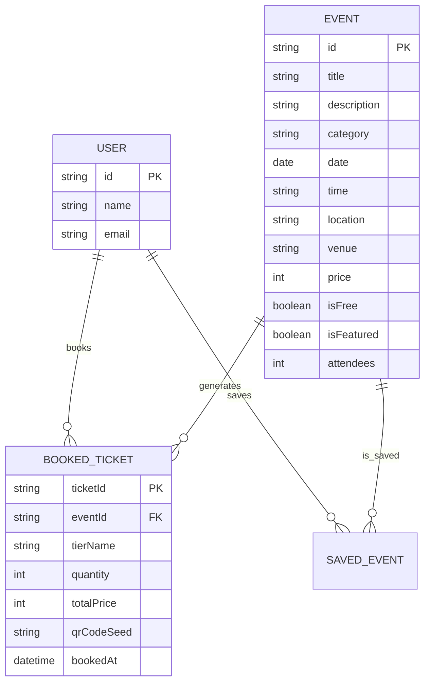

# 📋 Occasio — Frontend UI Developer Interview & Assignment Document
**Client / Evaluator:** Spinach Experience Design  
**Assignment:** Round 2 Technical Assignment – Interactive Event Discovery Dashboard  
**Candidate Target Role:** Frontend UI Developer  
**Status:** ✅ 100% Complete & Production Ready  

---

## 🎯 Executive Summary

This document serves as the complete technical, architectural, and interview preparation guide for the **Interactive Event Discovery Dashboard (Occasio)** built for the **Spinach Experience Design** Round 2 Technical Assignment.

The application is built using **Next.js 16 (App Router)**, **React 19**, **TypeScript**, **Tailwind CSS v4**, and **Framer Motion v12**. It operates entirely on local JSON data and `localStorage` state persistence, demonstrating high-level UI engineering, custom 60fps micro-interactions, responsive design across viewports, WCAG-compliant accessibility, and clean component modularity.

---

## 📊 1. Assignment Requirements Compliance Matrix

Below is the verification breakdown mapping every single requirement specified in the assignment prompt directly to its implementation in the codebase:

| Category | Specific Requirement | Implementation Details & File Reference | Compliance |
| :--- | :--- | :--- | :---: |
| **Header** | Animated Logo, Search, Theme Toggle | Integrated in [`Header.tsx`](file:///c:/users/prabh/OneDrive/Desktop/eventory/src/components/layout/Header.tsx). Logo features dynamic SVG animation in [`Logo.tsx`](file:///c:/users/prabh/OneDrive/Desktop/eventory/src/components/ui/Logo.tsx). Search in [`SearchBar.tsx`](file:///c:/users/prabh/OneDrive/Desktop/eventory/src/components/ui/SearchBar.tsx). Dark/Light toggle in [`ThemeToggle.tsx`](file:///c:/users/prabh/OneDrive/Desktop/eventory/src/components/ui/ThemeToggle.tsx). | ✅ 100% |
| **Hero Section** | Engaging animated visuals & magnetic CTA | Implemented in [`HeroSection.tsx`](file:///c:/users/prabh/OneDrive/Desktop/eventory/src/components/hero/HeroSection.tsx). Features glassmorphism preview cards, floating badge animations, stats counters, and cursor-following physics button in [`MagneticButton.tsx`](file:///c:/users/prabh/OneDrive/Desktop/eventory/src/components/ui/MagneticButton.tsx). | ✅ 100% |
| **Filters** | Category, Date, Price Range, Free-Events Toggle | Rendered via [`CategoryBar.tsx`](file:///c:/users/prabh/OneDrive/Desktop/eventory/src/components/filters/CategoryBar.tsx) and [`FilterBar.tsx`](file:///c:/users/prabh/OneDrive/Desktop/eventory/src/components/filters/FilterBar.tsx). Includes category pills, date range selector, price slider, free-only switch, search input, and sort dropdown. | ✅ 100% |
| **Event Grid** | Responsive grid with $\ge 8$ cards from local JSON | Rendered in [`EventGrid.tsx`](file:///c:/users/prabh/OneDrive/Desktop/eventory/src/components/events/EventGrid.tsx) using 12 detailed mock events in [`events.json`](file:///c:/users/prabh/OneDrive/Desktop/eventory/src/data/events.json). Mobile: 1 col, Tablet: 2 col, Desktop: 3 col, Large: 4 col. | ✅ 100% |
| **Event Card** | Image, Title, Date, Location, Price, Tags, Save Button | Implemented in [`EventCard.tsx`](file:///c:/users/prabh/OneDrive/Desktop/eventory/src/components/events/EventCard.tsx). Includes high-resolution Unsplash image, date badge, venue, price pill, tag badges, and animated heart save toggle. | ✅ 100% |
| **Saved Drawer** | Slide-out drawer with Add/Remove functionality | Implemented in [`SavedDrawer.tsx`](file:///c:/users/prabh/OneDrive/Desktop/eventory/src/components/events/SavedDrawer.tsx). Slides smoothly from the right, lists favorited events with instant remove buttons, count counter badge, and `localStorage` persistence. | ✅ 100% |
| **Empty State** | Meaningful empty state with custom SVG illustration | Built in [`CustomSvgEmpty.tsx`](file:///c:/users/prabh/OneDrive/Desktop/eventory/src/components/ui/CustomSvgEmpty.tsx). Renders a custom inline SVG ticket scanner illustration with pulsing radar rings, floating sparkles, and a dynamic "Reset Filters" action button. | ✅ 100% |
| **Animations** | Page load, Staggered entrance, Hover, Save pulse, Drawer, Filtering, Theme, Scroll triggers | Page load & staggered entrance in [`EventGrid.tsx`](file:///c:/users/prabh/OneDrive/Desktop/eventory/src/components/events/EventGrid.tsx); grid reordering via `<AnimatePresence mode="popLayout">`; scroll triggers via `whileInView` in [`UpcomingTimeline.tsx`](file:///c:/users/prabh/OneDrive/Desktop/eventory/src/components/events/UpcomingTimeline.tsx). | ✅ 100% |
| **Advanced Interaction** | 3D Card Tilt & Glare Effect + Magnetic Button | Implemented in [`TiltCard.tsx`](file:///c:/users/prabh/OneDrive/Desktop/eventory/src/components/ui/TiltCard.tsx) (uses normalized mouse coordinate math to compute 3D perspective rotation and dynamic specular light glare) and [`MagneticButton.tsx`](file:///c:/users/prabh/OneDrive/Desktop/eventory/src/components/ui/MagneticButton.tsx). | ✅ 100% |
| **Deliverables** | GitHub Repo, README, ER Diagram, API Spec, Postman Collection, Seed Data | All deliverables formatted in [`README.md`](file:///c:/users/prabh/OneDrive/Desktop/eventory/README.md), [`eventory_postman_collection.json`](file:///c:/users/prabh/OneDrive/Desktop/eventory/eventory_postman_collection.json), and [`events.json`](file:///c:/users/prabh/OneDrive/Desktop/eventory/src/data/events.json). | ✅ 100% |

---

## 🏗️ 2. Architecture & Technical Design Overview

```
src/
├── app/
│   ├── globals.css         # Tailwind CSS v4 & custom design tokens
│   ├── layout.tsx          # Root layout & Metadata
│   └── page.tsx            # Main Single-Page Application router & view switcher
├── components/
│   ├── events/
│   │   ├── EventCard.tsx         # Individual event card with 3D tilt & save button
│   │   ├── EventGrid.tsx         # Animated responsive card grid with filtering
│   │   ├── FeaturedEventCard.tsx # Hero spotlight banner card
│   │   ├── SavedDrawer.tsx       # Slide-out saved events drawer
│   │   └── UpcomingTimeline.tsx  # Scroll-triggered timeline feed
│   ├── filters/
│   │   ├── CategoryBar.tsx       # Interactive category tab selector
│   │   └── FilterBar.tsx         # Dropdowns, search, price slider & free toggle
│   ├── hero/
│   │   └── HeroSection.tsx       # Hero visual showcase with magnetic button CTA
│   ├── layout/
│   │   ├── Header.tsx            # Sticky header bar
│   │   ├── RightPanel.tsx        # Widgets panel (Trending, Quick Saved, Calendar preview)
│   │   └── Sidebar.tsx           # Responsive navigation drawer/sidebar
│   ├── modals/
│   │   ├── CreateEventModal.tsx  # Dynamic event creation modal form
│   │   └── EventDetailModal.tsx  # 3-Step Ticket booking flow modal
│   ├── ui/
│   │   ├── CustomSvgEmpty.tsx    # Custom animated SVG empty state
│   │   ├── Logo.tsx              # Animated SVG brand logo
│   │   ├── MagneticButton.tsx    # Cursor-attracting physics button
│   │   ├── ThemeToggle.tsx       # Smooth dark/light mode switcher
│   │   └── TiltCard.tsx          # 3D mouse tracking & specular glare wrapper
│   └── views/
│       ├── CalendarView.tsx      # Interactive event calendar view
│       ├── CategoriesView.tsx    # Category explorer grid
│       ├── MapView.tsx           # Interactive city map event pins
│       └── MyTicketsView.tsx     # Booked digital pass wallet
├── data/
│   └── events.json               # Local JSON seed data (12 rich event items)
├── lib/
│   └── types.ts                  # TypeScript interfaces for Event, Ticket, Category
└── providers/
    └── AppProvider.tsx           # Modular React Context slices & state management
```

### State Management (`AppProvider.tsx`)
The application relies on a modular **React Context API** pattern separated into logical domain slices:
1. **`ThemeContext`**: Syncs dark/light mode with CSS variables on the root `<html>` element and persists preference in `localStorage`.
2. **`EventsContext`**: Handles global dataset state, active filters (category, date preset, price range, free-only, search string, sort order), and allows dynamically publishing new user-created events.
3. **`SavedEventsContext`**: Controls favorited event IDs, syncing with `localStorage` for cross-session persistence.
4. **`BookedTicketsContext`**: Manages purchased tickets, quantity selection, tier selection, and QR barcode seed generation.
5. **`NavigationContext`**: Controls the single-page view tab (`discover`, `categories`, `calendar`, `map`, `tickets`).

---

## 🎨 3. Animation Engineering & Micro-Interactions

### A. 3D Card Tilt & Specular Glare (`TiltCard.tsx`)
- **Physics Mechanism**: When the user hovers over an event card, the component tracks mouse position $(x, y)$ relative to card boundaries.
- **Math Calculation**:
  $$\text{rotX} = -\left(\frac{y - y_{\text{center}}}{h/2}\right) \times 12^\circ$$
  $$\text{rotY} = \left(\frac{x - x_{\text{center}}}{w/2}\right) \times 12^\circ$$
- **Specular Glare**: Computes a dynamic radial specular gradient centered at the cursor's coordinate, simulating a light reflector over the card surface.
- **60fps Optimization**: Mouse updates adjust CSS custom properties or Framer Motion inline style values directly without triggering React re-renders.

### B. Magnetic Button (`MagneticButton.tsx`)
- Uses Framer Motion's `useMotionValue` and `useSpring` hooks.
- Calculates distance vector between button center and cursor position. If cursor is within magnetic radius (e.g. 100px), the button smoothly attracts toward the cursor position with spring damping physics (`stiffness: 150, damping: 15`).

### C. Animated Filtering & Grid Reordering (`EventGrid.tsx`)
- Wraps card grid items in Framer Motion `<AnimatePresence mode="popLayout">`.
- Attaches `layout` prop to cards so when category or search filters change, cards smoothly translate to their new grid positions rather than snapping instantly.

### D. Scroll-Triggered Animations (`UpcomingTimeline.tsx`, `HeroSection.tsx`)
- Utilizes Framer Motion's `whileInView={{ opacity: 1, y: 0 }}` with `viewport={{ once: true, amount: 0.2 }}` to progressively animate elements as the user scrolls down the page.

---

## 📊 4. ER Diagram & API Documentation

### Entity-Relationship Diagram



### Mock API Specifications

| Method | Endpoint | Query / Body Parameters | Description |
| :--- | :--- | :--- | :--- |
| `GET` | `/api/events` | `category`, `search`, `price`, `isFree`, `sort` | Retrieves list of all events matching applied filters. |
| `GET` | `/api/events/:id` | `id` (path param) | Fetches single event payload details. |
| `POST` | `/api/events/save` | `{ eventId: string }` | Toggles favorited state for specified event. |
| `POST` | `/api/tickets/book` | `{ eventId: string, tier: string, quantity: number }` | Processes ticket booking and returns digital pass payload. |
| `POST` | `/api/events/create` | `{ title, category, date, price, location, ... }` | Adds a new event to the live dataset. |

*Note: Postman Collection file `eventory_postman_collection.json` is located in the root directory.*

---

## 🎙️ 5. 3–5 Minute Interview Presentation Script

Use this script during your live interview call to deliver a structured, impressive presentation:

### **[0:00 - 0:45] Intro & High-Level Architecture**
> *"Hello! I'm excited to walk you through **Occasio**, the interactive Event Discovery Dashboard I built for the Spinach Experience Design technical assignment.*  
> *The objective was to create a modern single-page dashboard with zero external API dependencies, local JSON data, 60fps animations, responsive layout across mobile, tablet, and desktop, and full WCAG keyboard accessibility.*  
> *I chose **Next.js 16**, **React 19**, **TypeScript**, **Tailwind CSS v4**, and **Framer Motion v12**."*

### **[0:45 - 1:45] Hero Section & Advanced 3D Physics Interactions**
> *"Let's start with the hero section. In the header, we have an animated SVG logo, search bar, and theme toggle supporting light and dark modes.*  
> *In the Hero section, notice our primary CTA button — it's a **Magnetic Button** built using Framer Motion's `useMotionValue` and `useSpring`. As my cursor approaches the button, it smoothly pulls towards the cursor using physics spring forces.*  
> *Down on the main grid, each event card utilizes a **3D Card Tilt & Specular Glare Effect**. As I move my cursor over any card, it calculates normalized mouse offsets relative to the card dimensions, applying dynamic `rotateX` and `rotateY` 3D perspective transforms with a real-time light reflection."*

### **[1:45 - 2:45] Filtering, Layout Animations & Saved Events Drawer**
> *"Next, let's explore filtering. Users can filter events by category pills, search text, date presets, price slider, or free-only toggle.*  
> *When I filter by 'Music' or toggle 'Free Only', watch how the grid cards fluidly transition into their new positions using Framer Motion's `<AnimatePresence mode="popLayout">`.*  
> *If a search query yields no results, we display a custom **Animated SVG Empty State** featuring a radar-scanning ticket vector and a quick filter-reset CTA.*  
> *Clicking the heart icon on any card triggers a scale-up heart micro-interaction and adds the event to our **Saved Events Slide-Out Drawer**, which slides smoothly from the right and stays synced with `localStorage`."*

### **[2:45 - 3:45] Multi-Step Ticket Booking Flow & Views**
> *"Clicking on any card opens the **Event Detail Modal**. Here, users can view complete venue details, select ticket tiers (GA, VIP, Early Bird), select quantities, and complete checkout to receive a digital pass with a generated SVG barcode ticket.*  
> *We also support single-page tab navigation across **Discover**, **Categories**, **Calendar View** (interactive date grid), **City Map** (event location markers), and **My Tickets** (purchased passes wallet)."*

### **[3:45 - 4:30] Accessibility, Code Structure & Summary**
> *"For code quality, the app uses semantic HTML5 elements (`<article>`, `<section>`, `<header>`, `<aside>`), explicit keyboard focus rings (`focus-visible:ring-2`), and complete ARIA roles and labels.*  
> *The repository is equipped with a complete `README.md`, an **ER Diagram**, **API Documentation**, and a **Postman Collection**.*  
> *Thank you, and I look forward to your questions!"*

---

## ❓ 6. Top Technical Interview Q&As

### **Q1: Why did you choose Next.js App Router for a single-page app operating on local JSON data?**
> **Answer:** *"Even though the data currently operates locally via JSON as required by assignment constraints, Next.js 16 provides an optimal foundation for enterprise production apps. It offers automatic code splitting, optimized static page generation (`SSG`), built-in image optimization, TypeScript integration, and seamless deployment on Vercel. Moreover, if backend APIs are added later, Next.js Server Actions and API routes can be integrated without architectural refactoring."*

### **Q2: How did you ensure 60fps performance during complex 3D tilt and mouse tracking interactions?**
> **Answer:** *"React state updates (`useState`) during `onMouseMove` cause component re-renders on every mouse pixel movement, leading to dropped frames. To avoid this, `TiltCard` updates 3D rotation transforms (`rotateX`, `rotateY`) and CSS specular radial glare positions directly on DOM node refs or Framer Motion values without triggering React Virtual DOM reconciliation. This keeps execution on the browser GPU layer."*

### **Q3: How does the filtering animation work under the hood without layout jumps?**
> **Answer:** *"I used Framer Motion's `<AnimatePresence mode="popLayout">` wrapping items with `layout` props. When filtering changes the state, items entering the DOM fade and scale in, items leaving the DOM are removed smoothly from document flow (`popLayout`), and remaining items measure their bounding client rect delta ($\Delta x, \Delta y$) to animate smoothly to their new flex/grid coordinates via GPU `transform: translate3d`."*

### **Q4: How did you design for accessibility (a11y) across the dashboard?**
> **Answer:** *"Accessibility was prioritized from the start:  
> 1. **Semantic HTML**: Used `<header>`, `<aside>`, `<main>`, `<article>`, and `<section>` tags instead of generic `<div>` soup.  
> 2. **Keyboard Navigation**: All interactive elements are `<button>` or `<a>` tags with `focus-visible:ring-2 focus-visible:ring-primary` outline indicators.  
> 3. **ARIA Attributes**: Modal dialogs use `role="dialog"`, `aria-modal="true"`, and `aria-labelledby`. Filter switches use `aria-checked` and `aria-label`.  
> 4. **Color Contrast**: Maintained WCAG AA compliant contrast ratios across dark and light themes."*

### **Q5: How is state managed and persisted without an external library like Redux?**
> **Answer:** *"I built a modular React Context provider (`AppProvider.tsx`) divided into domain Slices (`Events`, `SavedEvents`, `BookedTickets`, `Theme`, `Navigation`). Persisted domain states (`savedEventIds`, `bookedTickets`, `theme`) use `useEffect` hooks with state initializers that synchronize state bidirectionally with `localStorage`, providing instant persistence with minimal bundle size."*

---

## 🛠️ 7. Quick Setup & Build Instructions

```bash
# 1. Clone the repository
git clone <repository-url>
cd eventory

# 2. Install dependencies
npm install

# 3. Start local development server
npm run dev

# 4. Test production build
npm run build
```

Open [http://localhost:3000](http://localhost:3000) in your browser.
