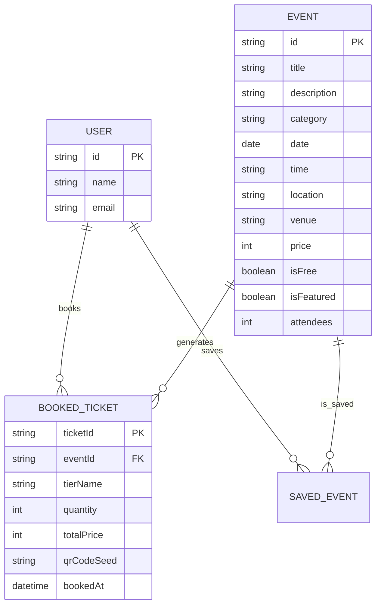

# Occasio — Event Discovery Dashboard

**Occasio** is an interactive, responsive single-page Event Discovery Dashboard built with **Next.js 16**, **React 19**, **TypeScript**, **Tailwind CSS v4**, and **Framer Motion v12**. 

It operates entirely on local JSON data and client-side state persistence, demonstrating high-quality UI engineering, micro-interactions, responsive design, and accessible architecture.

---

## 🔗 Quick Links
- **Live Demo:** [Vercel / Netlify Link]
- **Repository:** [GitHub Repository URL]
- **Walkthrough Video:** [3–5 Min Video Link]

---

## 🚀 Key Features

- **Dynamic Filtering:** Search events in real-time, filter by category, date, price range, and free-only toggle.
- **Interactive Views:** Seamless single-page tab switching across **Discover**, **Categories**, **Calendar View**, **City Map**, and **My Tickets**.
- **Ticket Booking Flow:** 3-step interactive booking modal (Details → Ticket Tier & Quantity → Checkout → Digital Pass with QR code).
- **Saved Events Drawer:** Slide-over right panel with instant bookmark persistence in `localStorage`.
- **Event Creation:** Organizer modal for publishing custom events dynamically to the live dashboard.
- **Custom Empty State:** SVG ticket-search illustration with dynamic reset filters CTA.

---

## 🎭 Animations & Micro-Interactions

| Interaction | Technique / API | Description |
| :--- | :--- | :--- |
| **Magnetic Button** | `useMotionValue` & `useSpring` | Primary CTA tracks cursor position and magnetically pulls toward it. |
| **3D Card Tilt & Glare** | `rotateX`, `rotateY`, `glareX`, `glareY` | Cards tilt on 3D perspective axes with a real-time radial specular light glare. |
| **Grid Reordering** | `<AnimatePresence mode="popLayout">` | Cards smoothly animate into new positions when category or search filters change. |
| **Scroll Reveals** | `whileInView` & `viewport` | Sections reveal progressively with opacity and slide transforms when scrolled into view. |
| **Drawer Slide** | Framer Motion spring physics | Saved events slide-over drawer opens and closes smoothly (`x: "100%"` to `0`). |

---

## 🛠 Tech Stack

- **Framework:** Next.js 16 (App Router) & React 19
- **Language:** TypeScript (Strict typing, 0 compilation errors)
- **Styling:** Tailwind CSS v4 + Custom CSS Variable Design Tokens
- **Animations:** Framer Motion v12
- **Icons:** Lucide React
- **State Management:** React Context API (`AppProvider`) + `localStorage` persistence

---

## ⚙️ Quick Setup

```bash
# 1. Clone the repository
git clone <repository-url>
cd eventory

# 2. Install dependencies
npm install

# 3. Start development server
npm run dev
```

Open [http://localhost:3000](http://localhost:3000) in your browser.

---

## 🏗 Architecture Highlights

1. **State Management (`AppProvider.tsx`)**: Modular React Context providers handle global state (`Theme`, `Navigation`, `Events`, `SavedEvents`, `BookedTickets`, `Modals`, `Notifications`) synced with `localStorage`.
2. **Performance Optimizations**: 3D tilt tracking updates motion values directly without triggering React component re-renders, maintaining 60fps performance.
3. **Responsive Design**: Custom breakpoint layout grid for seamless rendering across Desktop, Tablet, and Mobile viewports.

---

## ♿ Accessibility & UX Best Practices

- **Semantic HTML5 Markup**: Extensive use of `<article>`, `<section>`, `<aside>`, `<header>`, and `<nav>` elements to build a well-structured document outline.
- **Keyboard Navigation**: All interactive elements utilize `<button>` and `<a>` tags with visible focus rings (`focus-visible:ring-2 focus-visible:ring-primary`).
- **ARIA Context & Descriptions**: Includes `aria-label`, `aria-expanded`, `aria-checked`, `aria-hidden`, and `aria-labelledby` attributes for icon buttons, drawers, and filter switches.
- **WCAG Contrast Compliance**: Maintained strict contrast ratios across text (`text-foreground`, `text-muted-foreground`) and background surfaces in both light and dark modes.

---

## 📊 Mock ER Diagram & API Documentation

### Entity-Relationship (ER) Diagram



### Mock API Endpoints

| Method | Endpoint | Description |
| :--- | :--- | :--- |
| `GET` | `/api/events` | Retrieves all events (filterable by `category`, `search`, `price`, `isFree`). |
| `GET` | `/api/events/:id` | Fetches details for a specific event. |
| `POST` | `/api/tickets/book` | Books ticket tiers and returns digital pass payload with QR seed. |
| `POST` | `/api/events/save` | Toggles favorited state for an event. |
| `POST` | `/api/events/create` | Publishes a new event to the live feed. |
